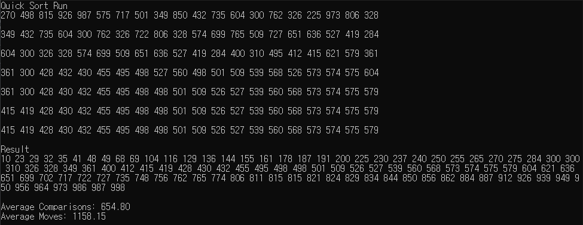
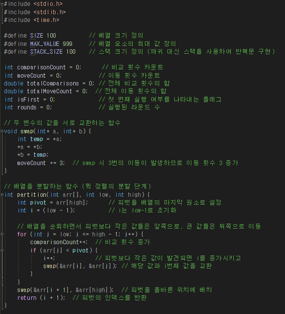
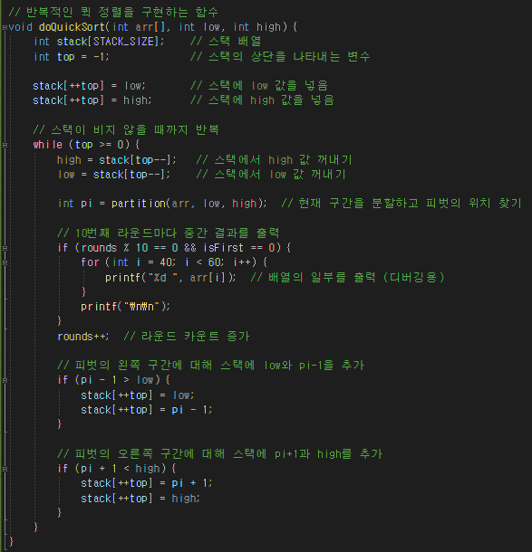
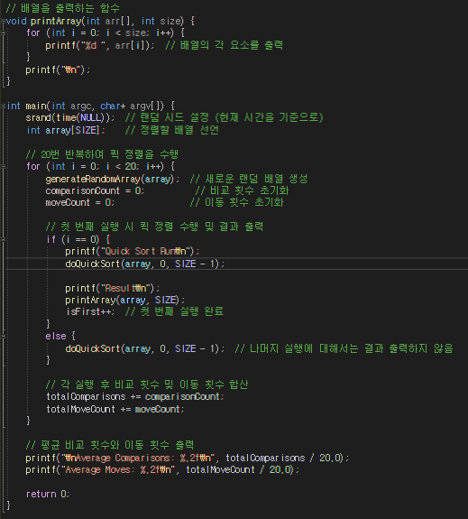
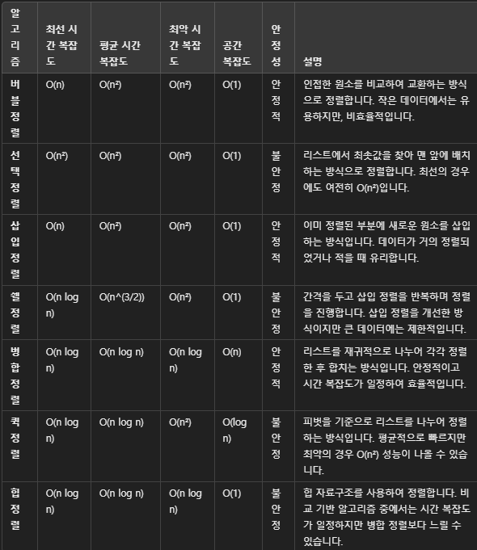

# 14-quicksort {Result Image}

성능 비교

버블 정렬: 인접한 원소를 비교하여 교환하면서 정렬하는 방식입니다. 데이터가 거의 정렬된 경우 빠르게 동작할 수 있지만, 대체로 비효율적입니다.
선택 정렬: 리스트에서 최솟값을 찾아 맨 앞에 배치하는 방식입니다. 비록 시간 복잡도가 O(n²)지만, 교환 횟수가 적어 메모리 사용은 효율적입니다. 그러나 여전히 큰 데이터에는 비효율적입니다.
삽입 정렬: 이미 정렬된 부분에 새로운 원소를 삽입하는 방식으로 동작합니다. 거의 정렬된 데이터나 작은 데이터에서 매우 효율적이지만, 큰 데이터에는 성능이 저하됩니다.
쉘 정렬: 삽입 정렬을 개선하여, 간격을 두고 원소를 비교하며 정렬하는 방식입니다. 간격을 점차 줄여가며 최종적으로 삽입 정렬을 수행합니다. 특정 구현에서는 O(n log n) 성능을 보이지만, 그 구현에 따라 성능이 달라질 수 있습니다.
병합 정렬: 리스트를 절반씩 나누어 정렬하고 병합하는 방식입니다. 안정적이고 최악의 경우에도 O(n log n) 성능을 유지하지만, 추가적인 공간이 필요합니다.
퀵 정렬: 피벗을 선택하고, 피벗을 기준으로 데이터를 분할하여 재귀적으로 정렬하는 방식입니다. 평균적으로 매우 빠르고, 메모리 사용이 적지만, 최악의 경우 성능이 떨어질 수 있습니다.
힙 정렬: 힙 자료구조를 사용하여 정렬합니다. 최대 힙(또는 최소 힙)을 이용해 정렬하며, 시간 복잡도가 일정하므로 예측 가능한 성능을 보입니다. 하지만 병합 정렬에 비해 약간 느릴 수 있습니다.
