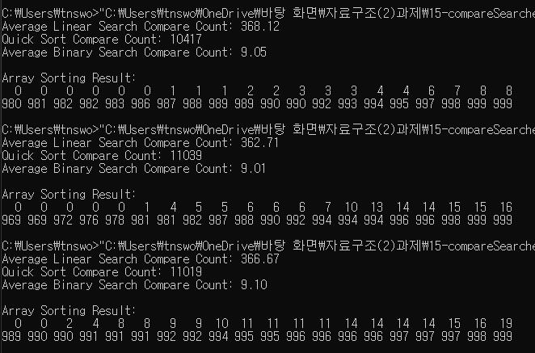
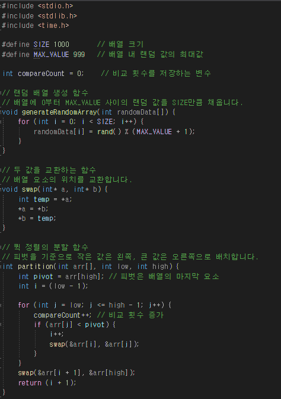
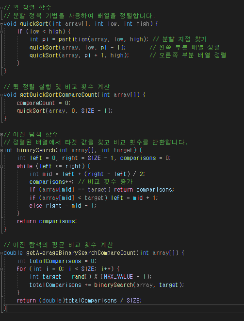
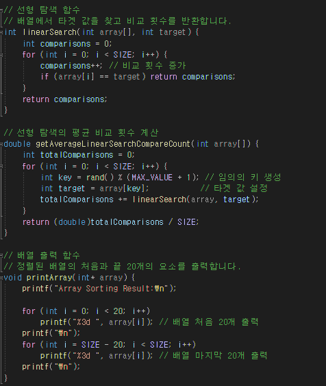
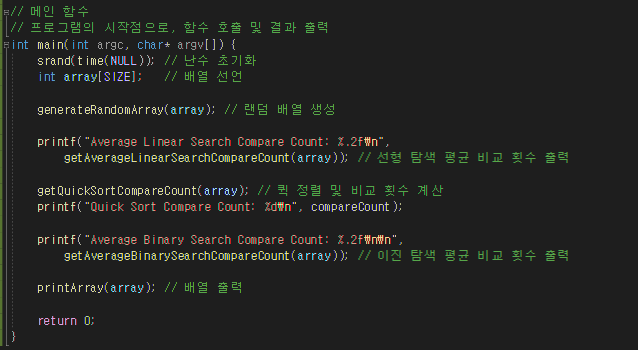

#  15-compareSearches {Result Image}

결과분석
**비교 횟수 A, B, C에 대한 해석**
1. **순차탐색 평균 비교횟수(A)**  
   - 순차탐색은 배열을 정렬하지 않은 상태에서 임의의 숫자를 처음부터 끝까지 순차적으로 탐색합니다. 비교 횟수는 탐색 위치에 따라 크게 변동하며, 평균적으로 \( N/2 \)에 해당하는 비교를 수행합니다.  
   - 비교가 배열의 크기에 선형적으로 증가하기 때문에 효율성이 낮습니다.

2. **퀵 정렬 비교횟수(B)**  
   - 퀵 정렬은 분할과 정복 방식을 사용하여 배열을 정렬합니다. 평균적으로 \( O(N \log N) \)의 비교가 발생합니다.  
   - 배열을 정렬된 상태로 변환하기 때문에 이후의 탐색이 효율적입니다.

3. **이진탐색 평균 비교횟수(C)**  
   - 정렬된 배열에 대해 이진탐색은 탐색 범위를 절반으로 줄여나가며, 평균적으로 \( O(\log N) \)의 비교 횟수를 가집니다.  
   - 순차탐색보다 훨씬 적은 비교 횟수를 기록하며, 데이터 크기가 커질수록 효율성이 두드러집니다.

**퀵 정렬 후 이진탐색이 순차탐색보다 효율적인 이유**  
- 이진탐색은 정렬된 배열에서만 사용할 수 있지만, 한 번 정렬 후에는 검색이 매우 빠릅니다.  
- 퀵 정렬로 배열을 정렬하는 데 시간이 들지만, 이후 탐색에서 절약되는 비교 횟수가 이를 상쇄합니다.  
- 따라서 데이터 크기가 크고 탐색이 빈번할수록 정렬 후 탐색의 효율성이 뛰어납니다.  
