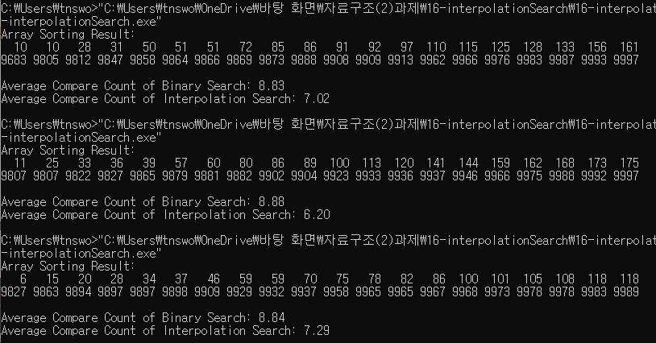
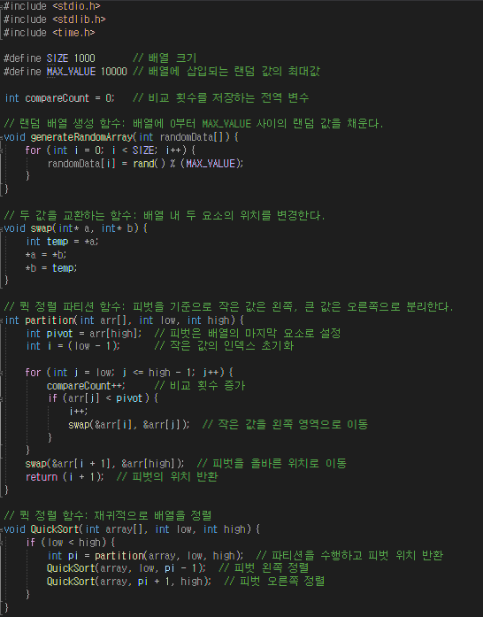
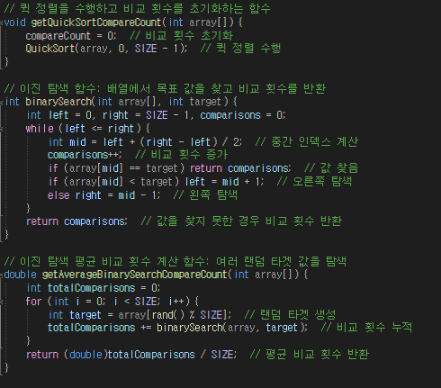
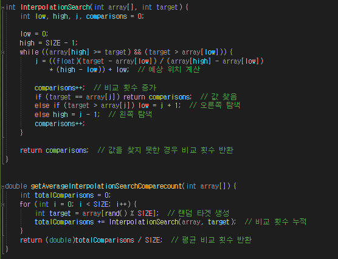
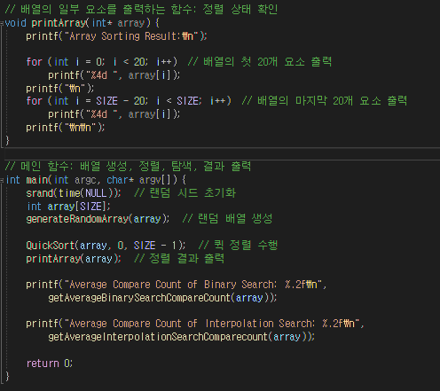

# 16-interpolationSearch {Result Image}

### 결과분석: Interpolation Search와 Binary Search 비교

**Interpolation Search가 Binary Search보다 적게 비교하는 이유**

1. **탐색 방식의 차이**  
   Binary Search는 항상 탐색 범위를 절반으로 나누며 탐색하지만, Interpolation Search는 값의 분포에 따라 탐색 지점을 추정합니다. 데이터가 균일하게 분포되어 있다면, Interpolation Search는 목표값의 위치를 더 정확하게 예측할 수 있습니다. 

2. **분포 기반 예측**  
   Interpolation Search는 목표값이 전체 데이터의 분포에서 어느 위치에 있을지 계산하여 탐색 지점을 설정합니다. 이러한 계산은 탐색 범위를 크게 줄일 수 있어 평균 비교 횟수를 감소시킵니다.

3. **데이터의 정렬된 특성 활용**  
   Interpolation Search는 정렬된 데이터의 값 분포를 기반으로 작동하며, 데이터가 정렬되어 있을 경우 특정 값이 나타날 가능성이 높은 위치를 효율적으로 예측할 수 있습니다.

4. **비교 횟수의 차이**  
   Binary Search는 항상 로그 기반으로 탐색을 수행하므로, 최악의 경우에도 \(O(\log n)\)의 비교 횟수가 필요합니다. 반면 Interpolation Search는 데이터가 균일하게 분포되어 있다면 \(O(\log \log n)\)의 시간 복잡도를 가지며, 비교 횟수가 현저히 줄어듭니다.

5. **한계점**  
   Interpolation Search는 데이터가 불균일하게 분포되어 있거나, 값이 극단적으로 치우쳐 있는 경우에는 Binary Search보다 더 많은 비교를 필요로 할 수 있습니다. 하지만 이 실험에서는 데이터가 0부터 9999 사이의 랜덤 값으로 균일하게 분포되었기 때문에, Interpolation Search가 더 효율적으로 작동했습니다.

**결론**  
Interpolation Search는 정렬된 데이터와 균일한 값 분포를 가진 환경에서 Binary Search보다 평균적으로 적은 비교 횟수를 요구합니다. 이는 알고리즘이 데이터의 분포를 활용하여 탐색 지점을 더 효율적으로 설정하기 때문입니다.
